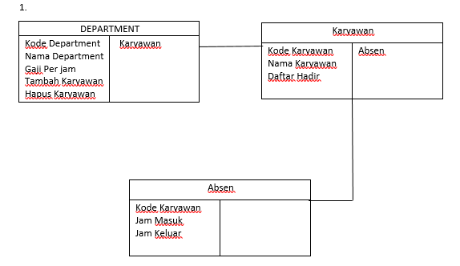
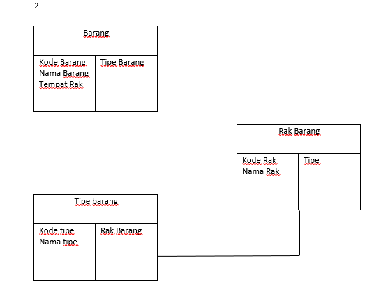

# Latihan 1

CRC card

1. CRC Gaji Karyawan
2. CRC Manajemen Barang

CRC GAJI KARYAWAN

Tentukan dulu apa saja yang biasa ada di pembelian

1. Department
2. Karyawan
3. Absen

DEPARTMENT

```txt
-------------------------------------
| DEPARTMENT                        |
-------------------------------------
| Kode Department  |   Karyawan     |
| Nama Department  |                |
| Gaji Per jam     |                |
| Tambah Karyawan  |                |
| Hapus Karyawan   |                |
-------------------------------------
```

KARYAWAN

```txt
-------------------------------------
| KARYAWAN                          |
-------------------------------------
| Kode Karyawan   |  Absen          |
| Nama Karyawan   |                 |
| Daftar Hadir    |                 |
-------------------------------------
```

ABSEN

```txt
-------------------------------------
| ABSEN                             |
-------------------------------------
| Kode Karyawan  |                  |
| Jam Masuk      |                  |
| Jam Keluar     |                  |
-------------------------------------
```

FULL IMAGE


CRC MANAJEMEN BARANG

Tentukan dulu apa saja yang biasa ada di pembelian

Tipe Barang
Rak Barang
Barang

TIPE BARANG

```txt
-------------------------------------
| TIPE BARANG                       |
-------------------------------------
| Kode Tipe   |   Rak               |
| Nama Tipe   |                     |
-------------------------------------
```

RAK BARANG

```txt
-------------------------------------
| RAK BARANG                        |
-------------------------------------
| Kode Rak   |  Tipe                |
| Nama Rak   |                      |
-------------------------------------
```

BARANG

```txt
-------------------------------------
| BARANG                            |
-------------------------------------
| Kode Barang   |   Rak             |
| Nama Barang   |                   |
| Tempat Rak    |                   |
-------------------------------------
```

FULL IMAGE


