# Latihan 1

Pada latihan 1 yaitu membuat sebuah database beserta tabelnya dengan menggunakan Shell. berikut ini merupakan perintah-perintah yang terdapat dalam mysql.

1. Create Database

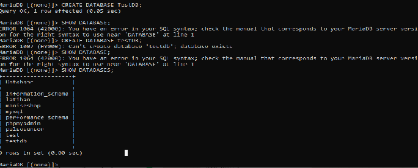

Bentuk perintah di atas akan membuat sebuah database baru dengan nama testDB. Aturan penamaan sebuah database sama seperti aturan penamaan sebuah variabel, dimana secara umum nama database boleh terdiri dari huruf, angka dan under-score (\_).

2. Use Database

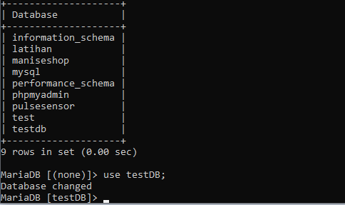

Penggunaan Use database yaitu untuk memilih database mana yang akan kita lakukan perubahan.

3. Create Table

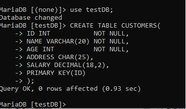

CREATE TABLE adalah perintah yang digunakan untuk membuat sebuah table di database mysql. nama_table adalah penamaan untuk table didalam database. nama_field adalah penamaan untuk field atau kolom didalam table.

4. Insert Table

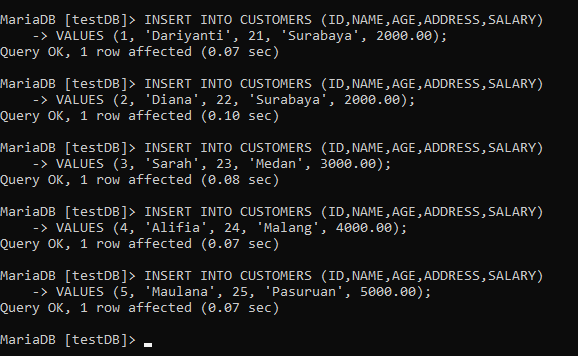

INSERT Pada MySQL. Seperti namanya INSERT, pastinya digunakan untuk memasukkan, menyimpan atau menambahkan data ke table pada database.

5. Select Table

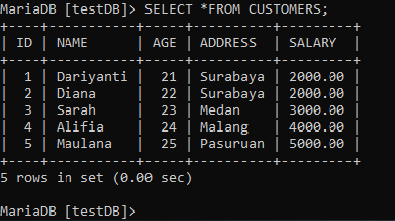

SELECT TABLE berfungsi untuk menampilkan seluruh isi tabel yang sudah kita buat sebelumnya. bisa juga hanya menampilkan kolom dan baris yang kita inginkan.

6. Describe Table

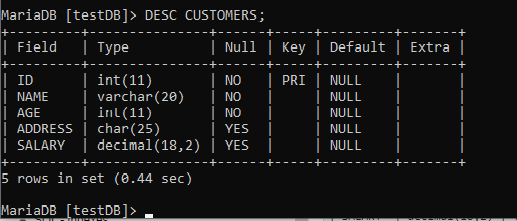

DESC merupakan singkatan dari DESCRIBE (dalam query bisa ditulis lengkap
atau hanya 4 karakter pertama) dan Customer adalah nama tabel yang akan dilihat
strukturnya.

7. Where

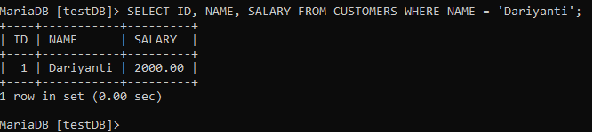

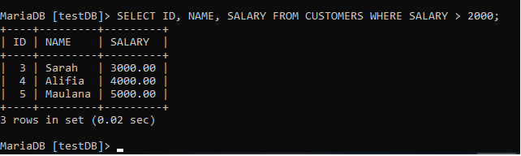

8. Operator AND & OR

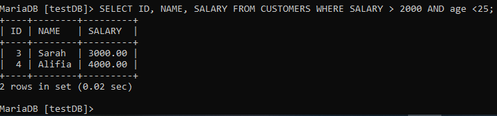

9. Update Table

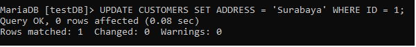

Digunakan untuk mengubah/memperbarui data di tabel database. Update selalu diikuti dengan where clause.

10. Delete

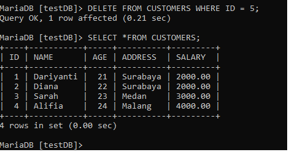

Digunakan untuk menghapus data di table database. Tambahkan perintah Where untuk memfilter data-data tertentu yang akan dihapus. Jika tanpa perintah Where, maka seluruh data dalam tabel akan terhapus.

11. Like Clause

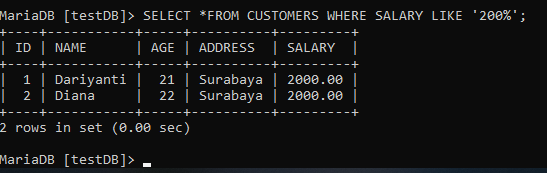

12. TOP Clause

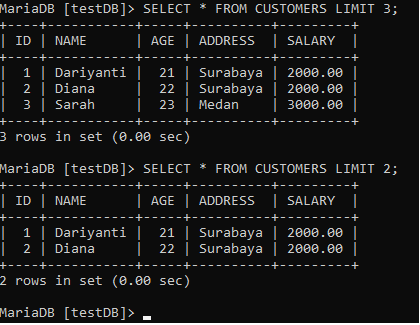

13. Order By

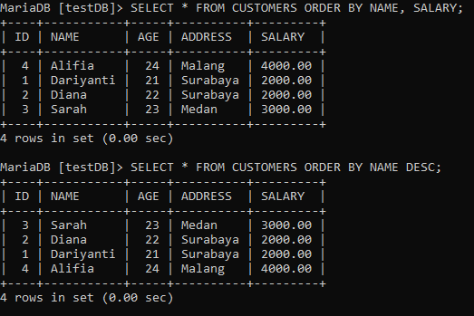

14. Group By

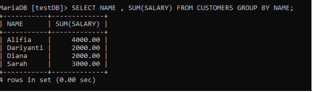

15. Distinct Keyword

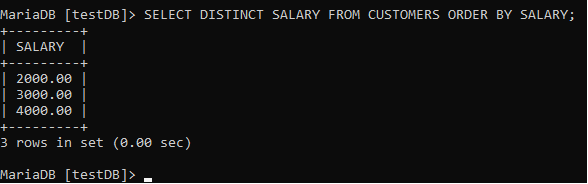

16. Sorting Result

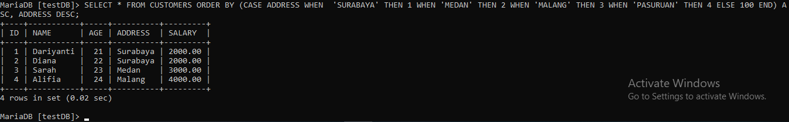
