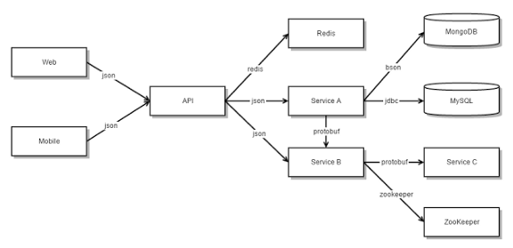
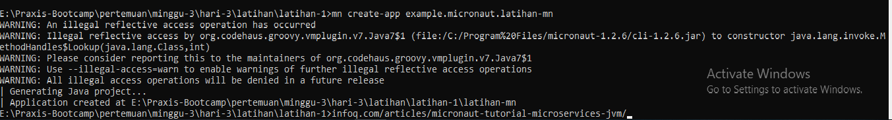
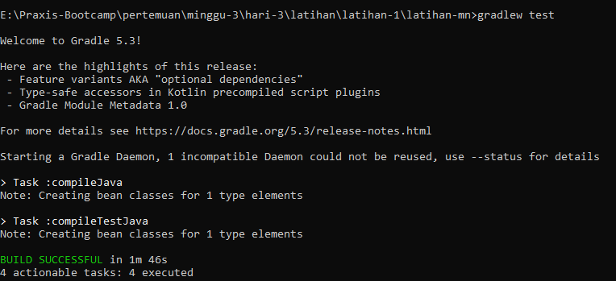
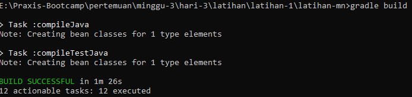
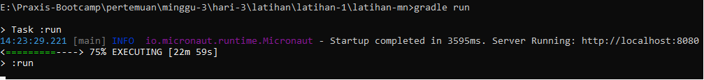
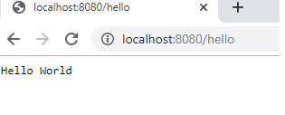

# Tentang Micronaut dan Microservise

Micronaut adalah sebuah framework dengan Teknologi modern yang berjalan di base on JVM/Java Virtual Machine (tentunya JAVA) dengan Full Stack Microservice Framework. Micronaut tidak menyediakan fitur MVC, jika anda ingin menggunakan fitur MVC atau anda yang familiar dengan MVC bisa menggunakan plugin yang telah disediakan misalnya GORM.

Sedangkan Microservice berarti membagi aplikasi menjadi layanan yang lebih kecil dan saling terhubung.
Pola arsitektur Microservice secara signifikan mempengaruhi hubungan antara aplikasi dan database. Alih-alih berbagi skema database tunggal dengan services lainnya, masing-masing services memiliki skema database tersendiri.
Di satu sisi, pendekatan ini bertentangan dengan gagasan model data enterprise-wide. Selain itu, sering kali menghasilkan duplikasi beberapa data. Namun, memiliki skema database per service sangat penting jika ingin mendapatkan keuntungan dari layanan microservice.
Masing-masing service memiliki database sendiri. Selain itu, services dapat menggunakan jenis database dan bahasa pemrograman yang paling sesuai dengan kebutuhannya.

berikut merupakan langkah2 micronaut

1. Download terlebih dahulu `Micronaut` di `Micronaut.io`
2. pilih yang binary
3. extract ke folder C program file
4. copy bin nya kemudian letakan di `environment variabel`.
5. lalu buka cmd ketikan perintah `mn create-app example.micronaut.nama-folder`

   

6. kemudian buat file java didalam folder `micronaut(src/main/java/example/micronaut)`
7. setelah itu buka `cmd` ketikan perintah `gradlew test`

8. setelah itu `gradle build`

9. setelah itu `gradle run`

10. kemudian ketikan di browser `localhost:8080/hello`(sesuai port dan sesuai nama controller yang akan ditampilkan)

