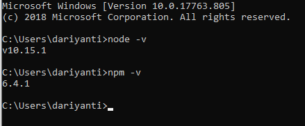

# Latihan 1 Install Node.js

Node.js adalah sebuah engine atau mesin yang digunakan untuk mengembangkan aplikasi bebasis web dan ditulis dalam sintak bahasa javascript. jadi jika js berjalan disisi client maka node js juga bisa berjalan disisi server.

berikut langkah-langkah install node.js di Windows

1. Download Installer Node.js yang telah di sediakan untuk windows `https://nodejs.org/en/download/`
2. pilih sesuai spesifikasi laptop.
3. setelah di download maka di extract ke `C:/program files`
4. copy address bin ke System Environment Variabel path.
5. cek hasil Instalasi dengan buka terminal ketikan `node -v`
6. jika muncul versi dari node.js berarti node.js telah berhasil terinstall.

