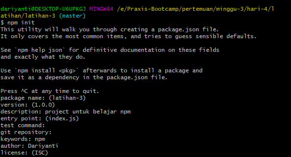
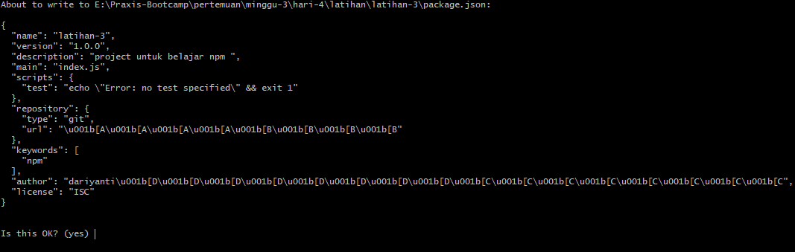
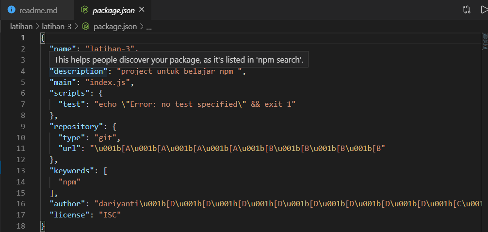
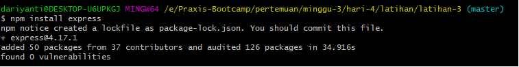
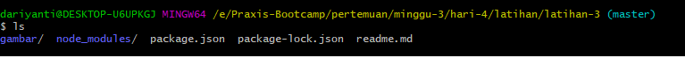

# Latihan 3 membuat Project dengan NPM

langkah-langkah membuat Project dengan NPM

1. pertama harus menyediakan direktori untuk projectnya dengan perintah `mkdir nama-folder`.

2. lalu masuk ke direktori tersebut dan ketik perintah `npm init` untuk membuat agar di dalam direktori tersebut terdapat folder npm.
3. NPM akan meminta kita mengisi deskripsi dll.

4. setelah kita mengisi maka akan muncul `package.json` Package.json adalah file manifes proyek. Menggunakan package.json Anda dapat mengelola dependensi dan menulis skrip. Ia memiliki semua data meta tentang proyek.

5. pada direktrori kita akan muncul sebuah file dengan nama `package.json` yang isinya seperti ini:

Note :untuk membuat package.json dengan cepat maka hanya dengan menggunakan `npm init -y`

6. Install Package

   Paket yang diinstal secara lokal hanya dapat diakses pada folder yang telah Anda unduh. cara menginstal package lokal yaitu dengan perintah `npm install nama-package`

   

didalam direktori yang telah terinstal npm akan muncul file dengan nama `package-lock.json` 

