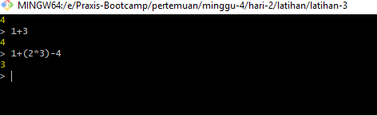
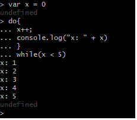
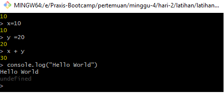

# Latihan 3 menjalankan Node.js di Terminal

1. untuk memulai node.js di terminal adalah dengan memasukan perintah :`$ node`
2. membuat operasi matematika simpel

3. Multiline Expressions
   

4. penggunaan Variabel

